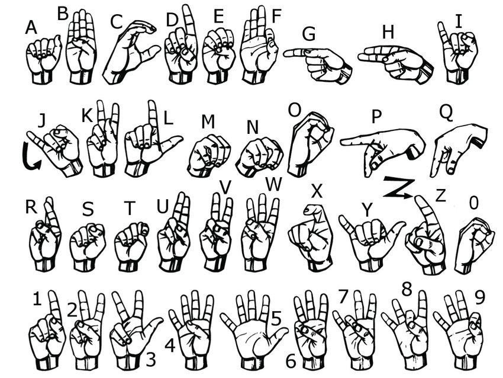

# 

SynapSign is a project that merges "synapse" and "sign," symbolizing the connection point between nerve cells and sign language.
It aims to integrate technology with sign language to enhance communication for the hearing impaired, emphasizing both the neurological aspect and the use of sign language as a primary means of communication.

## Purpose

+ To encourage the learning of sign language and increase social awareness.
+ To facilitate the learning of sign language by recognizing sign language through the machine learning model.
+ To facilitate the learning of sign language by individuals with hearing impairments and individuals who do not know sign language.

## Modality and Articulations

A unimodal approach was adopted because a system was being planned to use images from the camera as input and attempt to comprehend sign language by processing hand gestures in these images.

In this context, the main tasks to be performed by the user were the following:
+ Hand Gestures and Signs: The user makes hand gestures to create certain signs.
+ Finger Positions: Finger positions and the position of the hand can determine the meaning of the sign.
+ Hand Coordination: Coordination of hand movements is important for the correct transmission of signs.

In our own work, American Sign Language was used.

### How it works?
What needs to be run in order to develop the model:

1. collect_imgs.py
2. create_dataset.py
3. train_classifier.py
   
It can then be run with a simple interface with gui.py.
